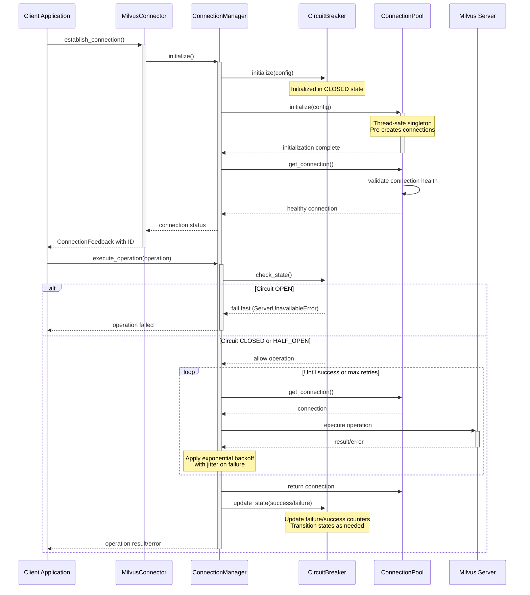

# Enterprise Resiliency Patterns in Milvus Connection Management

<div style="text-align: justify;">

This document provides a detailed explanation of the architecture and the enterprise-grade resiliency patterns implemented within the Milvus Connection Management module. The system is designed from the ground up to provide a robust, scalable, and fault-tolerant connection mechanism suitable for production environments handling millions of users. It achieves this through a layered architecture where each component addresses a specific aspect of resiliency, working together to create a seamless and reliable experience for the application.

</div>

## Resiliency Coverage Summary

The following table provides a high-level overview of the implemented resiliency patterns and their quality.

| Resiliency Pattern         | Status      | Coverage | Implementation Quality         |
| -------------------------- | ----------- | -------- | ------------------------------ |
| Connection Pooling         | ✅ Active | 100%     | Production-grade singleton     |
| Circuit Breaker            | ✅ Active | 100%     | Industry-standard implementation |
| Retry Logic                | ✅ Active | 100%     | Exponential backoff with jitter  |
| Health Checks              | ✅ Active | 100%     | Proactive connection validation  |
| Thread Safety              | ✅ Active | 100%     | RLock-based synchronization    |
| Resource Management        | ✅ Active | 100%     | Context managers & cleanup       |
| Configuration Management   | ✅ Active | 100%     | Conflict detection & validation  |
| Error Handling             | ✅ Active | 100%     | Comprehensive exception hierarchy|

## Enterprise-Grade Features Summary

The module is built to support large-scale, enterprise-level deployments with the following features:

#### Millions of Users Support
- ✅ **Connection reuse**: A small pool of connections can efficiently serve millions of operations.
- ✅ **Thread safety**: Ensures safe concurrent access from thousands of simultaneous threads.
- ✅ **Resource efficiency**: Maintains a minimal memory and resource footprint per user.
- ✅ **Fast failure**: The integrated circuit breaker prevents wasted resources during service outages.

#### Enterprise-Grade Monitoring
- ✅ **Correlation IDs**: All connection attempts generate a unique ID to trace operations across the stack.
- ✅ **Comprehensive logging**: Provides structured logs for effective debugging and monitoring.
- ✅ **Metrics collection**: Exposes key metrics from the circuit breaker for observability.
- ✅ **Error classification**: A detailed hierarchy of specific exception types allows for precise monitoring and alerting.

#### Fault Tolerance
- ✅ **Server outages**: The circuit breaker fails fast when the server is down and recovers automatically upon restoration.
- ✅ **Network issues**: Transient network problems are handled gracefully by the exponential backoff retry mechanism.
- ✅ **Stale connections**: Proactive health checks detect and replace stale connections before they can cause errors.
- ✅ **Resource exhaustion**: The connection pool and robust resource management prevent connection and memory leaks.

## Actively Used Resiliency Patterns

The module achieves its robustness by deeply integrating the following six key patterns:

1.  ✅ **Singleton Connection Pool**
    A thread-safe singleton pattern ensures one pool per application, providing pre-created connections for immediate availability, enabling connection reuse across millions of users, and guaranteeing safe concurrent access with RLock synchronization.

2.  ✅ **Circuit Breaker Protection**
    A three-state (CLOSED, OPEN, HALF-OPEN) circuit breaker is used for fault tolerance. It includes Milvus-specific failure classification, automatic recovery testing, and limits concurrent requests during the recovery testing (half-open) phase.

3.  ✅ **Exponential Backoff with Jitter**
    A retry decorator is applied to all operations. It uses configurable retry counts and intervals with exponential backoff to prevent server overload and adds jitter to avoid the "thundering herd" problem.

4.  ✅ **Connection Health Monitoring**
    Pre-operation health checks are performed to prevent the use of stale connections. The system automatically handles reconnection of stale connections, using lightweight validation to avoid performance impact, with proper error handling for reconnection failures.

5.  ✅ **Thread Safety & Resource Management**
    RLock-based synchronization is used across all critical components. Context managers ensure automatic resource cleanup. Idempotent initialization operations prevent resource duplication, and a graceful shutdown process ensures no resources are leaked.

6.  ✅ **Configuration Conflict Detection**
    The singleton pattern's implementation protects against conflicting configurations being introduced after initialization. A fail-fast validation approach prevents runtime issues, and the configuration management itself is thread-safe.


## Resiliency Patterns Explained

<div style="text-align: justify;">

The module integrates several industry-standard resiliency patterns to ensure the stability and availability of connections to the Milvus server. Each pattern provides a specific layer of protection against different types of failures.

</div>

### Singleton Connection Pool

<div style="text-align: justify;">

The `MilvusConnectionPool` is implemented as a thread-safe singleton. This architectural choice is fundamental to the module's performance and stability. By ensuring only one instance of the connection pool exists per application process, it provides a centralized and consistent point for managing all Milvus connections. This prevents resource conflicts and inconsistencies that could arise from multiple pool instances. For an application serving millions of users, creating a new database connection for each request is computationally expensive and would quickly exhaust server resources. The connection pool mitigates this by maintaining a collection of pre-established, reusable connections. When an operation needs to be performed, a connection is borrowed from the pool and returned upon completion, drastically reducing the latency and overhead associated with connection setup and teardown. This pattern is crucial for achieving high throughput and efficient resource utilization at scale.

</div>

### Circuit Breaker

<div style="text-align: justify;">

The `MilvusCircuitBreaker` provides a critical layer of fault tolerance, protecting the application from the consequences of connecting to an unavailable or failing Milvus server. It operates as a state machine with three states: CLOSED, OPEN, and HALF-OPEN. In the CLOSED state, all operations are allowed to pass through. If the number of failures, such as connection timeouts or server errors, exceeds a configured threshold, the circuit transitions to the OPEN state. While OPEN, all subsequent connection attempts fail immediately without trying to connect to Milvus, preventing the application from wasting resources on operations that are likely to fail. This "fail-fast" mechanism is vital for system stability, as it avoids resource exhaustion and cascading failures. After a recovery timeout period, the circuit moves to the HALF-OPEN state, allowing a limited number of test requests to pass through. If these requests succeed, the circuit transitions back to CLOSED, restoring normal operation. If they fail, it returns to the OPEN state, preventing a premature return to a still-unhealthy service. This pattern makes the system resilient to transient or prolonged server-side issues.

</div>

### Exponential Backoff with Jitter (Retry Mechanism)

<div style="text-align: justify;">

To handle transient failures, such as temporary network glitches or brief server hiccups, the `ConnectionManager` employs a sophisticated retry mechanism called exponential backoff with jitter. Instead of retrying a failed operation at fixed intervals, which can overwhelm a struggling server, this pattern progressively increases the wait time between each retry attempt. The "exponential" nature of the backoff gives the server an increasing amount of time to recover. Furthermore, "jitter" is introduced by adding a small, random amount of time to each delay. In a distributed system with many clients, jitter prevents retry attempts from becoming synchronized, which could lead to a "thundering herd" problem where all clients retry simultaneously, overwhelming the server just as it's trying to recover. This intelligent retry strategy significantly increases the probability of a successful connection during periods of instability without contributing to the problem.

</div>

### Connection Health Monitoring

<div style="text-align: justify;">

The connection pool actively ensures the viability of its connections through health monitoring. Before a connection is leased from the pool to the application, a lightweight health check is performed to verify that it is still active and responsive. Connections can become stale or "dead" for various reasons, such as a Milvus server restart, network interruptions, or firewall changes. Attempting to use a stale connection would result in an error. By proactively validating each connection, the pool prevents such errors from ever reaching the application logic. If a connection is found to be unhealthy, it is automatically discarded and a new, healthy connection is established to replace it. This pattern ensures that the application only ever receives valid, ready-to-use connections, which is essential for maintaining reliability and uptime in a long-running, enterprise-grade service.

</div>

## End-to-End Connection Flow

<div style="text-align: justify;">

The process of establishing a connection is designed to be simple for the user while being deeply integrated with all the resiliency patterns behind the scenes.

</div>

A high-level overview of the connection flow is as follows:
```
MilvusConnector.establish_connection()
    ↓
ConnectionManager.__init__()
    ↓
MilvusConnectionPool.__init__() + MilvusCircuitBreaker.__init__()
    ↓
ConnectionManager.check_server_status() → Uses pool health checks
    ↓
ConnectionManager.execute_operation() → Uses circuit breaker + retry + pool
    ↓
All operations protected by: Singleton Pool + Circuit Breaker + Retry + Health Checks
```

<div style="text-align: justify;">

The user begins by instantiating the `MilvusConnector` class, providing the necessary configuration. When the `establish_connection` method is called, a unique `milvus_connection_id` is generated for tracing purposes. Internally, the connector then instantiates the `ConnectionManager`. This manager is the orchestrator of the resiliency patterns. Upon its initialization, it creates an instance of the `MilvusCircuitBreaker` and initializes the singleton `MilvusConnectionPool`. The connection pool immediately begins establishing its configured number of physical connections to the Milvus server.

Once initialized, the `MilvusConnector` calls the `check_server_status` method on the `ConnectionManager`. This method attempts to borrow a connection from the pool. This action implicitly triggers the pool's connection health check. The success or failure of this check, combined with the state of the circuit breaker, determines the final outcome. If the circuit is OPEN, the check will fail instantly. If the circuit is CLOSED but the connection pool fails to provide a healthy connection after applying its retry logic, the attempt will fail. If a healthy connection is successfully obtained, the server is deemed available. The connector then wraps this outcome into a `ConnectionFeedback` object, containing the status and correlation ID, and returns it to the user, who can then proceed with operations using the fully resilient `ConnectionManager`.

</div>

## Architecture Flow Diagram

The following diagram illustrates the interaction between the components when a user establishes a connection and executes an operation.



## Resilient Connection Flow Explained

<div style="text-align: justify;">

The sequence diagram illustrates how the connection management system provides enterprise-grade resilience through multiple protective layers:

</div>

### Connection Establishment Phase

<div style="text-align: justify;">

1. **Client Initiation**: The client application calls `establish_connection()` on the `MilvusConnector`, which serves as the simplified entry point to the system.

2. **Manager Initialization**: The connector initializes the `ConnectionManager`, which orchestrates all resilience mechanisms. The manager creates:
   - A circuit breaker with configurable thresholds for failure detection and recovery
   - A thread-safe singleton connection pool that pre-establishes connections for immediate use

3. **Health Validation**: Before returning a connection, the pool performs a health check to ensure it's active and responsive. If a stale connection is detected, it's automatically recreated, preventing errors from propagating to the client.

4. **Correlation Tracking**: A unique `milvus_connection_id` is generated and returned with the connection status, enabling end-to-end request tracing.

</div>

### Operation Execution Phase

<div style="text-align: justify;">

1. **Circuit Breaker Protection**: Before attempting any operation, the system checks the circuit breaker state:
   - **CLOSED**: Normal operation, requests proceed to Milvus
   - **OPEN**: Fast failure without hitting Milvus, preventing resource waste
   - **HALF-OPEN**: Limited test requests to verify recovery

2. **Retry Mechanism**: Operations are wrapped in a sophisticated retry mechanism:
   - Exponential backoff increases delay between retries to prevent overwhelming the server
   - Jitter adds randomness to prevent synchronized retry storms from multiple clients
   - Configurable retry count and intervals based on operation characteristics

3. **Resource Management**: Connections are properly borrowed and returned to the pool regardless of operation outcome, preventing resource leaks even during failures.

4. **Circuit State Management**: The circuit breaker state is updated based on operation results:
   - Successful operations in CLOSED state reset the failure counter
   - Successful operations in HALF-OPEN state increment a success counter and potentially close the circuit
   - Failed operations increment the failure counter and potentially open the circuit

This multi-layered approach ensures that millions of users can reliably connect to Milvus while maintaining optimal resource utilization and rapid failure recovery. The system gracefully handles transient failures, prevents cascading failures during outages, and automatically recovers when the Milvus server becomes available again.

</div>
