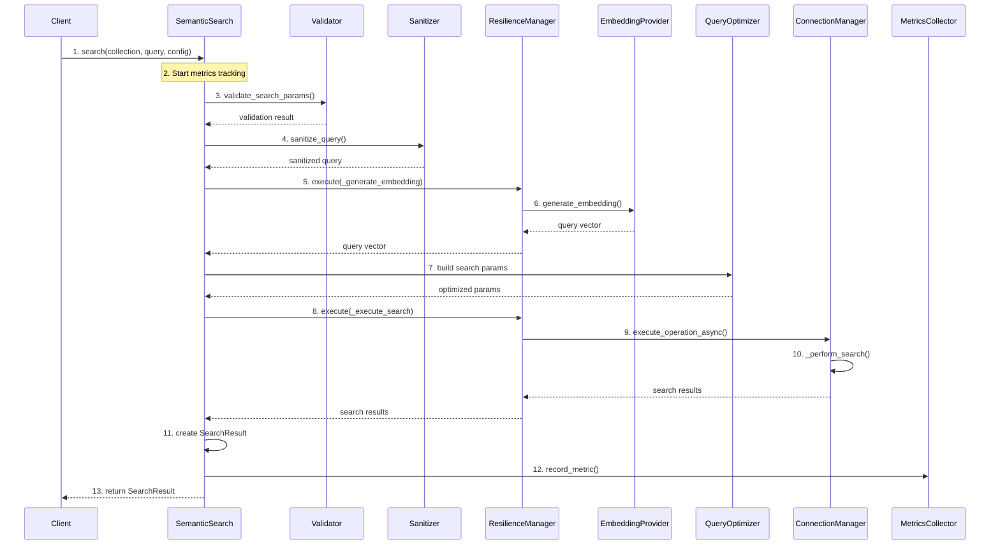

# Semantic Search Module

Production-grade semantic (dense vector) search implementation for Milvus with comprehensive fault tolerance, observability, and optimization.

## Architecture Overview

The semantic search module follows enterprise-level design principles with clear separation of concerns:

```
semantic/
├── engine.py           # Core search engine orchestration
├── reranking.py        # Search with reranking support
├── metrics.py          # Metrics collection and monitoring
├── resilience.py       # Fault tolerance (circuit breaker, retry)
├── validation.py       # Parameter validation and sanitization
├── optimization.py     # Query optimization and tuning
└── __init__.py         # Module exports
```

## Components

### 1. Engine (`engine.py`)

Core semantic search implementation that orchestrates all other components.

**Features:**
- Embedding generation with resilience
- Query optimization
- Comprehensive metrics collection
- Health check endpoints
- Batch search support

**Usage:**
```python
from search_operations.search.semantic import SemanticSearch

search = SemanticSearch(
    connection_manager=conn_manager,
    embedding_provider=embedding_provider,
    enable_circuit_breaker=True,
    enable_retry=True
)

result = await search.search(
    collection_name="documents",
    query="What is machine learning?",
    config=search_config
)
```

### 2. Metrics (`metrics.py`)

Comprehensive metrics collection and aggregation for search operations.

**Features:**
- Real-time metrics collection
- Aggregated statistics
- Configurable history retention
- Metrics callbacks for external monitoring

**Components:**
- `SearchMetrics`: Individual search operation metrics
- `SearchStatus`: Enumeration of search states
- `MetricsCollector`: Thread-safe metrics storage and aggregation

### 3. Resilience (`resilience.py`)

Fault tolerance patterns for robust search operations.

**Features:**
- Circuit breaker pattern
- Exponential backoff retry
- Configurable retry policies
- Jitter for preventing thundering herd

**Components:**
- `CircuitBreaker`: Prevents cascading failures
- `RetryHandler`: Automatic retry with backoff
- `ResilienceManager`: Combined resilience management
- `RetryConfig`: Retry behavior configuration

**Circuit Breaker States:**
- **CLOSED**: Normal operation, requests pass through
- **OPEN**: Too many failures, requests blocked
- **HALF_OPEN**: Testing service recovery

### 4. Validation (`validation.py`)

Parameter validation and query sanitization for security and integrity.

**Features:**
- Comprehensive parameter validation
- Query sanitization
- Injection attack prevention
- Milvus constraint enforcement

**Components:**
- `SearchValidator`: Validates all search parameters
- `QuerySanitizer`: Sanitizes queries and field names

**Validations:**
- Collection name format and length
- Query length and content
- top_k range (1 to 16384)
- Timeout values
- Metric type validity

### 5. Optimization (`optimization.py`)

Intelligent query optimization for better performance.

**Features:**
- Automatic index parameter tuning
- top_k-based optimization
- Index-aware optimization
- Consistency level suggestions

**Components:**
- `QueryOptimizer`: Optimizes search parameters
- `SearchParamsBuilder`: Builds optimized search params

**Optimization Strategies:**
- **IVF indexes**: Auto-tune `nprobe` based on top_k
- **HNSW indexes**: Auto-tune `ef` parameter
- **Metric-based**: Adjust precision for different metrics

## Usage Examples

### Basic Search

```python
from search_operations.search.semantic import SemanticSearch
from search_operations.config.semantic import SemanticSearchConfig

# Initialize search engine
search = SemanticSearch(
    connection_manager=conn_manager,
    embedding_provider=embedding_provider
)

# Configure search
config = SemanticSearchConfig(
    search_field="embedding",
    top_k=10,
    metric_type="COSINE"
)

# Execute search
result = await search.search(
    collection_name="my_collection",
    query="search query",
    config=config
)
```

### Search with Resilience Configuration

```python
from search_operations.search.semantic import SemanticSearch, RetryConfig

# Custom retry configuration
retry_config = RetryConfig(
    max_retries=5,
    initial_delay=1.0,
    max_delay=60.0,
    exponential_base=2.0,
    jitter=True
)

search = SemanticSearch(
    connection_manager=conn_manager,
    embedding_provider=embedding_provider,
    enable_circuit_breaker=True,
    enable_retry=True,
    retry_config=retry_config
)
```

### Metrics Monitoring

```python
# Get metrics summary
summary = await search.get_metrics_summary()
print(f"Success rate: {summary['success_rate']}")
print(f"Average search time: {summary['avg_search_time_ms']}ms")

# Get recent metrics
recent = await search.get_recent_metrics(limit=10)
for metric in recent:
    print(f"Query: {metric['query_hash']}, Time: {metric['total_time_ms']}ms")
```

### Health Check

```python
# Perform health check
health = await search.health_check()
print(f"Status: {health['status']}")
print(f"Circuit breaker state: {health['components']['resilience']}")
```

### Batch Search

```python
queries = [
    "What is AI?",
    "Explain neural networks",
    "How does deep learning work?"
]

results = await search.batch_search(
    collection_name="documents",
    queries=queries,
    config=config
)
```

### Custom Metrics Callback

```python
def metrics_callback(metric: SearchMetrics):
    # Send to monitoring system
    send_to_prometheus(metric)
    log_to_elasticsearch(metric)

search = SemanticSearch(
    connection_manager=conn_manager,
    embedding_provider=embedding_provider,
    metrics_callback=metrics_callback
)
```

## Best Practices

### 1. Enable Circuit Breaker in Production

Always enable circuit breaker to prevent cascading failures:

```python
search = SemanticSearch(
    connection_manager=conn_manager,
    embedding_provider=embedding_provider,
    enable_circuit_breaker=True
)
```

### 2. Configure Appropriate Retry Policy

Adjust retry configuration based on your requirements:

```python
retry_config = RetryConfig(
    max_retries=3,
    initial_delay=0.5,
    max_delay=30.0
)
```

### 3. Monitor Metrics

Regularly check metrics to identify performance issues:

```python
summary = await search.get_metrics_summary()
if summary['success_rate'] < 0.95:
    alert_team("Low search success rate")
```

### 4. Use Request IDs

Always provide request IDs for tracing:

```python
result = await search.search(
    collection_name="docs",
    query="query",
    config=config,
    request_id="req_123"
)
```

### 5. Enable Query Optimization

Let the optimizer tune parameters automatically:

```python
search = SemanticSearch(
    connection_manager=conn_manager,
    embedding_provider=embedding_provider,
    enable_query_optimization=True
)
```

## Performance Considerations

### top_k Optimization

- **small top_k (≤10)**: Lower nprobe/ef for faster search
- **medium top_k (10-100)**: Balanced parameters
- **large top_k (>100)**: Higher nprobe/ef for better recall

### Consistency Levels

- **Strong**: Best for small top_k, data accuracy critical
- **Bounded**: Default, good balance
- **Eventually**: Large top_k or tight timeouts

### Batch Operations

For multiple queries, use `batch_search()` for better throughput:

```python
results = await search.batch_search(
    collection_name="docs",
    queries=query_list,
    config=config
)
```

## Error Handling

The module provides specific exceptions for different failure scenarios:

```python
from search_operations.core.search_ops_exceptions import (
    SearchError,
    InvalidSearchParametersError,
    SearchTimeoutError
)

try:
    result = await search.search(...)
except InvalidSearchParametersError as e:
    # Handle validation errors
    log_error(f"Invalid parameters: {e}")
except SearchTimeoutError as e:
    # Handle timeout
    log_error(f"Search timed out: {e}")
except SearchError as e:
    # Handle general search errors
    log_error(f"Search failed: {e}")
```

## Monitoring and Observability

### Key Metrics to Monitor

1. **Success Rate**: Percentage of successful searches
2. **Average Latency**: Mean search time
3. **Circuit Breaker State**: Monitor for OPEN state
4. **Retry Count**: Track retry frequency
5. **Error Rate**: Monitor failure patterns

### Integration with Monitoring Systems

```python
def prometheus_callback(metric: SearchMetrics):
    metrics_registry.histogram(
        'search_latency_ms',
        metric.total_time_ms
    )
    metrics_registry.counter(
        'search_total',
        labels={'status': metric.status.value}
    )

search = SemanticSearch(
    connection_manager=conn_manager,
    embedding_provider=embedding_provider,
    metrics_callback=prometheus_callback
)
```

## Configuration Reference

### SemanticSearch Parameters

| Parameter | Type | Default | Description |
|-----------|------|---------|-------------|
| `connection_manager` | ConnectionManager | Required | Milvus connection manager |
| `embedding_provider` | EmbeddingProvider | Required | Embedding generation provider |
| `enable_circuit_breaker` | bool | True | Enable circuit breaker |
| `enable_retry` | bool | True | Enable automatic retry |
| `retry_config` | RetryConfig | Default | Retry configuration |
| `enable_query_optimization` | bool | True | Enable query optimization |
| `metrics_callback` | Callable | None | Metrics callback function |
| `max_metrics_history` | int | 1000 | Max metrics to retain |

### RetryConfig Parameters

| Parameter | Type | Default | Description |
|-----------|------|---------|-------------|
| `max_retries` | int | 3 | Maximum retry attempts |
| `initial_delay` | float | 0.5 | Initial retry delay (seconds) |
| `max_delay` | float | 30.0 | Maximum retry delay |
| `exponential_base` | float | 2.0 | Exponential backoff base |
| `jitter` | bool | True | Add jitter to delays |

## Thread Safety

All components are thread-safe and can be used in concurrent environments:

- Metrics collection uses async locks
- Circuit breaker state management is protected
- No shared mutable state without synchronization

## Testing

```python
# Health check before critical operations
health = await search.health_check()
if health['status'] != 'healthy':
    raise ServiceUnavailableError()

# Clear metrics between tests
await search.clear_metrics()
```

## Sequence Diagram

The following diagram illustrates the complete flow of a semantic search operation:



### Sequence Explanation

1. **Client Initiates Search**: The client calls `search()` with collection name, query text, and configuration.

2. **Metrics Tracking Begins**: The search engine starts tracking metrics including timestamp and query hash.

3. **Parameter Validation**: The `Validator` checks all parameters against constraints (collection name, query, top_k, etc.).

4. **Query Sanitization**: The `Sanitizer` processes the query to remove control characters and prevent injection attacks.

5. **Resilient Embedding Generation**: The search engine delegates to the `ResilienceManager` to handle embedding generation with retry/circuit breaker.

6. **Embedding Provider Call**: The embedding provider generates vector representation of the query text.

7. **Search Parameter Optimization**: The `QueryOptimizer` builds optimized search parameters based on the configuration and query characteristics.

8. **Resilient Search Execution**: The search engine delegates the actual search to the `ResilienceManager` for fault-tolerant execution.

9. **Connection Manager Operation**: The connection manager executes the search operation asynchronously.

10. **Milvus Search Execution**: The actual search is performed against the Milvus collection.

11. **Result Processing**: The search engine creates a `SearchResult` object with hits and metadata.

12. **Metrics Recording**: Search metrics (timing, result count, status) are recorded for monitoring.

13. **Result Return**: The final search result is returned to the client.

This flow demonstrates the clear separation of concerns and robust error handling throughout the search process. Each component has a specific responsibility, making the system maintainable and resilient.